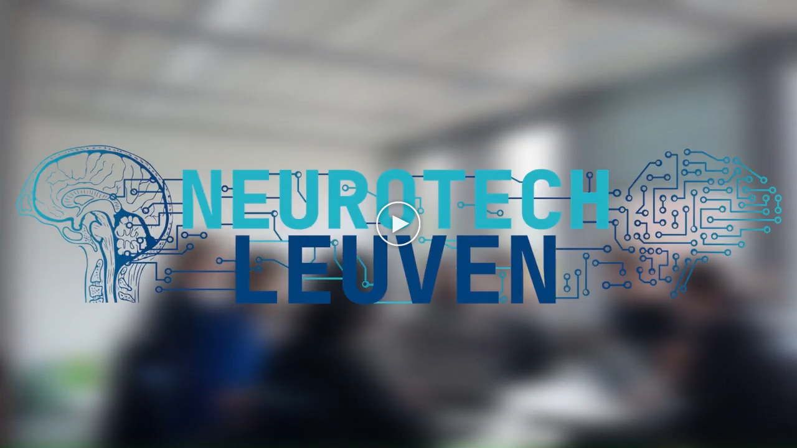
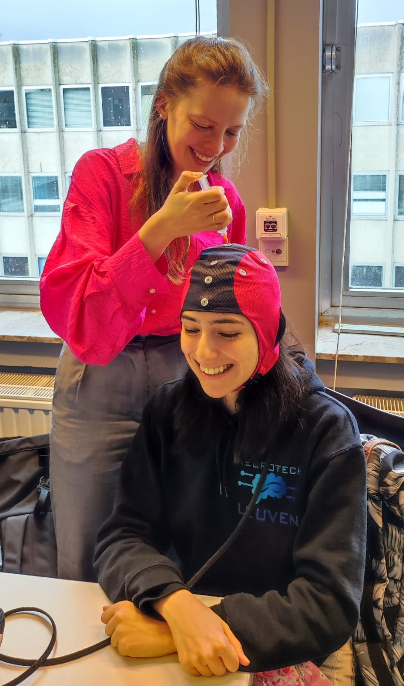

# Neurotech Leuven - The Mindwitcher Project

## Introduction
Welcome to the repository for the Mindwitcher project, developed by the Team Neurotech Leuven. This project is our submission for the Neurotech X competition 2024, where we present an innovative modification to the popular game *The Witcher 3*. The Mindwitcher project uses EEG (electroencephalogram) signals to control certain actions within the game, creating a unique gaming experience that merges neuroscience and technology.

[](https://youtu.be/djNqa87wX-M)

## Project Overview
From beginning to end, the Mindwitcher project focuses on utilizing EEG signals to control actions in *The Witcher 3* game. Specifically, we have implemented two types of functionalities:
1. **Spell Casting and Horse calling**: EEG signals related to movement and imagined movement are used to call for the player's horse and cast spells within the game.
2. **Emotion-based Weather Modification**: EEG signals related to the emotions of the player are used to dynamically modify the weather conditions within the game environment.

The proposed EEG solutions are either "plug-and-play", or require very
minimal per-session calibration to maximize accuracy and user experience.

For a full overview of the project the following diagram may be of use:


#### EEG data acquisition
The brain signals of interest in this project are your emotions and (imagined) movement by your left and right hand. The brain signals are measured using the AntNeuro headset (8 channel eego). This headset is easy to use and provides a good electrode placement for our application. Using this headset requires electrolyte gel – without it, the conductivity and accompanied signal quality are much worse.



#### OpenViBE
At the heart of the Mindwitcher is [OpenViBE](https://openvibe.inria.fr/), developed to easily create brain-computer interfaces. OpenViBE provides the link between the EEG data and the classification decision. It receives the real-time data and applies spectral filters and time epoching. Further processing is then done by Python scripts, in which the different data processing models are applied and a classification is made. 
- For **imaginary movement**, a decision is made each second based on the data of the past two seconds. 
- For **the emotions**, we make a decision every 30 seconds based on data of the most recent five seconds. 

#### Data processing
The signals obtained from the headset are perturbed by noise due to various effects, such as powerline interference, movement artefacts and other brain activity. Consequently, data needs to be processed with this in mind. For each of the stimuli different models were developed.
- For classifying __emotions__, only a Machine Learning model was developed, more details to be found [here](src/Emotions/README.md).
- For more details on the __imaginary movement__ models, see [here](<src/Imaginary Movement/README.md>). Two models were developed:
    1. A Machine Learning model using a Common Spatial Pattern (CSP) filter
    2. A Deep Learning model. 

The CSP model was eventually selected for use in the project video due to its slightly higher accuracy but could still be switched for the Deep Learning model without too much trouble. 

#### Game modification
Once the classification is decided, the right action needs to be executed in the game. This is done using keyboard commands, where Python code simulates a key press. For the two pipelines there are broadly two categories of actions.
1. **Simple actions**: these require just a single key press.
2. **Complex actions**: now we need to use the built-in debug console to change the game environment.

More details on the game modification are available [here](<src/Modding/README.md>).

## Repository Structure
The repository is organized into several folders:

#### 1. Drivers
Folder: `drivers`. This folder contains the drivers for the AntNeuro headset. They need to be installed to be able to use the headset, for more info on this, see [below](#installation-and-usage).

#### 2. Images
Folder: `images`. All images used in documenting this repository.

#### 3. Code
Folder: `src`. All code necessary to execute the full project pipeline. More info is to be found in [this file](src/README.md).

## Installation and Usage
The project requires a Windows installation to run its two main software components: the game and OpenViBE, with Python code to do all calculations and communication. 

OpenVIBE requires a specific python version and is not compatible with a virtual environment. To be able to run all code, install [Python version 3.10.11](https://www.python.org/downloads/release/python-31011/) and edit your Windows environment variables to put this installation on top of your PATH. All dependencies for the project can then be installed with
```bash
pip install -r requirements.txt
```

With the right version of Python installed, now install the latest version of [OpenViBE](https://openvibe.inria.fr). 

After installing OpenVIBE, we can start modding the game. For this, first install [The Witcher 3](https://www.thewitcher.com/pl/en/witcher3), which only officially runs on Windows. Complete the installation and execute our helper script:
```bash
python setup.py
```
and navigate to the directory where the game is installed. Typically, this is something like C:/Games/The Witcher 3.

To properly use the AntNeuro headset, the right drivers need to be installed. First connect the headset with its USB port to your pc. Then open your device manager and follow the steps from [step 8](https://www.wikihow.com/Copy-Drivers-from-One-Computer-to-Another-on-PC-or-Mac) onward. The driver files are included in the repository in `drivers`. Finally, configure the OpenVIBE acquisition server with the settings as seen in this image. 


Now all that's left to do is run the `main.py` file. It opens the OpenViBE Acquisition Server and gets it running. Once that's done, it starts running the model pipelines so just open the game and start playing!

## Limitations and future plans
While the current state of the project gives satisfactory results, it is not without limitations. Future research plans aim to address the following points specifically.
- Despite the impressive potential of our EEG-steered game, the current models face performance challenges primarily due to discrepancies between the training data and the real-time data obtained from our headset (transferring from a 64 channel to 8 channel headset). To address this, our future endeavors will focus on extensive data collection using our own headset, enabling us to train the models with data that closely mirrors actual usage conditions.
- In the initial stages, detecting real movements is more feasible than detecting imagined movements. However, by leveraging transfer learning techniques, we plan to progressively transition to imagined movement detection, allowing us to utilize the knowledge gained from real movement data to improve the model's ability to recognize and interpret imagined movements. 

## The team

The Neurotech Leuven team for the Mindwitcher project consists of the following people, listed alphabetically:
- Wout De Swaef
- Sofia Gonzalez Mezquita
- Tim Lauwers
- Thant Muang
- Orestis Lomis
- Mathijs Vanhaverbeke
- Lars Van Noten
- Anke Verhaege

## Acknowledgements
We would like to thank our sponsors, Ant-Neuro and Medtronic, for their generous support and believe in  our project. Furthermore, we extend our gratitude to our supervisors; thank you for sharing your knowledge and positive vibes throughout the year!

## Contact
For any inquiries or feedback regarding the Mindwitcher project, please contact hq@ntxl.org.

We hope you enjoy exploring the Mindwitcher project and experiencing the fusion of neuroscience and gaming!
