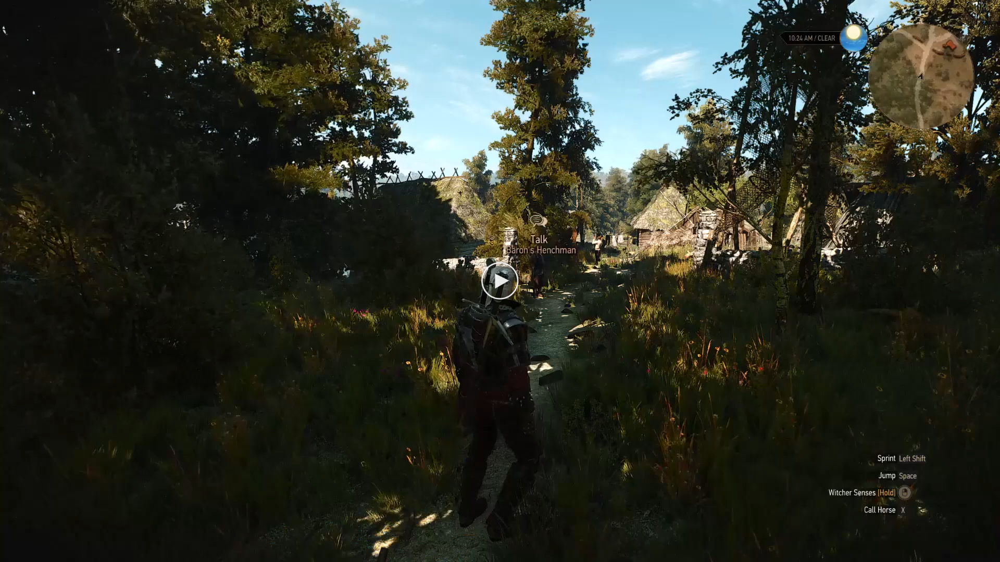

# Game modification
In our project the MindWitcher, we chose to work with the award winning game The Witcher 3 developed by CD Project Red, where you play as the famous Witcher Geralt of Rivia.
This document explains the decision process behind our choices regarding modifying the game 'The Witcher 3'. The game receives both inputs from the imaginary movement and emotions pipeline to then perform an action in the game, e.g., changing the game state, performing a movement, etc. 

## Three points of consideration
To link a neuro-interface with playing a game, there are several things to keep in mind:
1. __Time sensitivity__: Brain Computer Interfaces require several seconds of data to be able to make an informed decision. This fact excludes time sensitive games, such as Mario Kart.
2. __Error impact__: Neurotech applications are never 100% accurate, therefore games where every move has a high impact are excluded.
3. __Ease of implementation__: Our chosen game should offer sufficient functionality for us to modify, we need to be able to control the game without learning a new coding language or modifying source files.

Out of all possible games there was one extra soft requirement we looked after. We sought to control a magical action, as linking those to a brain command amplifies the magical feeling. 

In the end, we chose 'The Witcher 3', which satisfies the three points of consideration.
1. __Time sensitivity__: There are a lot of controllable actions, so we can choose an action that is not (too) time sensitive. Even so, the player can use their regular controller to perform the action if needed.
2. __Error impact__: It is an open world game, where wrongly executed actions can easily be reversed or ignored.
3. __Modding availability__: Unlike many other games, it has an in-built debug console, which means the game environment can be easily modified.

The playable character Geralt can execute 'signs' as magical action and so the game also suits the extra requirement. Moreover, 'The Witcher 3' is a well-known, highly awarded game with lots of online support if anyone would need it.

## Virtual keyboard to control the game
To execute in-game actions, virtual keyboard presses are used. This is done in Python using the [keyboard package](https://pypi.org/project/keyboard/). Amongst its mentioned features are several necessary for this project: it has hotkey support (e.g., Ctrl+V) and "maps keys as they actually are in your layout, with full internationalization support". This is important to support different keyboard layouts. As Neurotech Leuven is located in Belgium, we support AZERTY keyboards next to the internationally accepted QWERTY.

There are two points of attention:
1. __Focus__: The game tab must be in focus as to receive the keyboard presses.
2. __Timing__: A key must be held down long enough relative to the frame rate. 
    - For example, with a frame rate of 50fps, the key needs to be pressed at least 1/50 = 0.02 seconds. 
    - In our case we chose a minimum frame rate of 30fps, as it is widely considered to be the minimum for an enjoyable gaming experience.

## From classification to execution
Each classification in both pipelines is associated with an action in the game. For example, if the imagined movement pipeline classifies a left movement then Geralt will cast a spell. The below table gives a complete overview of the classifications and their in-game action, assuming a QWERTY keyboard.
| Data processing pipeline | Decision | In-game action                  | Type    | Control |
|--------------------------|----------|---------------------------------|---------|---------|
| Imaginary Movement       | left     | Cast a spell                    | Simple  | Q       |
| Imaginary Movement       | right    | Call your horse                 | Simple  | X       |
| Emotions                 | neutral  | Change weather to some clouds   | Complex | weatherCommand(Mid_Clouds)  |
| Emotions                 | happy    | Change weather to shining sun   | Complex | weatherCommand(Clear)       |
| Emotions                 | sad      | Change weather to rain          | Complex | weatherCommand(Storm)       |
| Emotions                 | fear     | Change weather to snow          | Complex | weatherCommand(Snow)        |

We differentiate between two types of actions. 
- Simple actions, associated with a single key press in the game. For this project these are casting a spell and calling your horse. 
- Complex actions, where a command must be entered in the debug console. This is necessary to change the weather. Rather than typing out everything letter by letter, the command is copied in the clipboard and later pasted in the debug console. The flow of execution shown below gives an idea how this happens for when a neutral emotion decision is made. 

## Conclusion

The Witcher 3 is a game perfectly suited to the needs of this project. It's magic system provides a perfect link with the 'brain commands'. With the in-built debug console, the game environment can easily be changed to our needs, something unattainable for almost every other game out there. Using virtual keyboard presses we can execute any action with ease and without delay. Below you can find a showcase of this, where only the camera panning is done manually and all other actions are executed by the code of this part of the project. Go to the video by clicking on the image.

